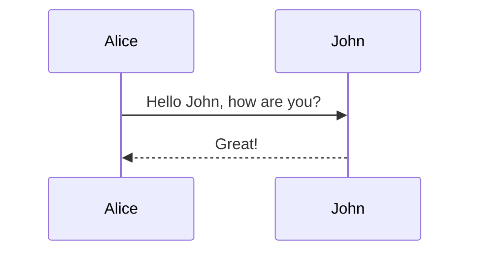

# Type on Strap 🎨

[](https://github.com/sylhare/Type-on-Strap/actions/workflows/jekyll-build.yml)
[](https://badge.fury.io/rb/type-on-strap)
[](https://hub.docker.com/r/sylhare/type-on-strap)

[](https://sylhare.github.io/Type-on-Strap/)

Esto es un fork con mi visión particular de este tema para [Jelyll](https://jekyllrb.com) que se basa en el tema original [sylhare/Type-on-Strap](https://github.com/sylhare/Type-on-Strap) y que segun la documentación original, a su vez
se basa en el tema de Rohan Chandra [type-theme](https://github.com/rohanchandra/type-theme) y sin ellos, este tema con mis modificaciones, no existiria

## Usage

En mi caso, lo uso a traves de este [contenedor docker](https://hub.docker.com/r/bretfisher/jekyll-serve) que hace todo el trabajo duro.

Yo solamente tengo que iniciarlo mediante ```docker start jekyll``` y ya tengo en marcha mi **estación de trabajo** en jekyll para hacer las pruebas y la creación de articulos para mi web para después subirlo a mi pagina web.

## Structure

En mi caso, mantengo la misma estructura original, pero le he
Here are the main files of the template

```shell
./Type-on-Strap
├── _includes	               # Theme includes
├── _layouts                   # Theme layouts (see below for details)
├── _portfolio	               # Collection of articles for the portfolio page
├── _posts                     # Blog posts
├── _sass                      # Sass partials (compiled into css at runtime)
├── assets
|  ├── js	               # JS compiled for distribution + raw sources
|  ├── css                     # CSS compiled for distribution
|  ├── fonts		       # Font-Awesome, and other fonts
|  └── img		       # Images used for the template
|   └─ images          # Imagenes especificas de los articulos que aparecen y que no tienen nada que ver con el resto de imagenes.
├── pages
|   ├── 404.md		       # To be displayed when url is wrong
|   ├── about.md               # About example page
|   ├── gallery.md             # Gallery page for your photos
|   ├── portfolio.md	       # Portfolio page for your projects
|   ├── search.md	       # Search page
|   └── tags.md                # The tag page
├── _config.yml                # sample configuration
├── _data
|  ├── authors.yml             # Update the post authors configurations 
|  ├── language.yml            # Localization configuration
|  ├── biblio.yml              # To create a reference bibliography
|  ├── social.yml              # Social configurations to share posts (RSS, shares, ...)
|  └── icons.yml               # Footer icons (Twitter, Github, Stackoverflow, ...)
└── index.html                 # sample home page (blog page paginated)
```
	
## Configure Type on Strap 🛠

Open `_config.yml` in a text editor to change most of the blog's settings.

If a variable in this document is marked as "optional", disable the feature by removing all text from the variable. 

### Site configuration

#### Base url

Configure Jekyll as your own blog or with a "baseurl" in `_config.yml`:

Jekyll website *without* a "baseurl" (such as a **GitHub Pages website** with your username as the repository name):

```yml
baseurl: ""
url: "https://username.github.io"
```

Jekyll website *with* "baseurl" (like the Type on Strap [demo](https://sylhare.github.io/Type-on-Strap/) page):

```yml
baseurl: "/sub-directory"
url: "https://username.github.io"
```

#### Jekyll blog configuration 

And here is the basic information you will need in your `_config.yml` for it to work properly:

```yaml
# BLOG CONFIGURATION
post_navigation: true
paginate: 10
paginate_path: "blog/page:num"
plugins: [jekyll-paginate, jekyll-seo-tag, jekyll-feed]
```

To configure the blog part and default plugins. Those plugins are validated by GitHub page.

#### Meta and Branding

_Meta variables_ hold basic information about your Jekyll site, which will be used throughout the site 
and as _meta properties_ that are used for search engines, browsers, and the site's RSS feed.

Change these variables in `_config.yml`:

```yml
title: My Jekyll Blog                 # Name of website
avatar: assets/img/avatar.png         # Path of avatar image, to be displayed in the theme's header
description: My blog posts            # Short description, primarily used by search engines
favicon: assets/favicon.ico           # Icon displayed in the tab
color_theme: auto                     # color theme auto, dark or light
```

You can also customize the seo tags default option following the jekyll-seo-tag plugin [documentation](http://jekyll.github.io/jekyll-seo-tag/advanced-usage/).
The color theme can be set to dark or light (customize it in _variables.scss_). 
Using _auto_ you'll have a tiny icon in the navbar allowing the use to manually switch from dark to light theme.

### Theme customization 🎨

#### Footer and Header text

Customize your site header/footer with these variables in `_config.yml`:

```yml
header_text: Welcome to my Jekyll blog
footer_text: Copyright 2017
```

If you don't want anything, replace the value by `" "`.

#### Header's image

The header's image (tested with 2480x1280) can be set as one image with `header_feature_image`
but can also be responsive:

```yml
header_feature_image: assets/img/header/my-header-image.png
header_feature_image_responsive: true
```

By setting `header_feature_image_responsive` to true, it will look for images 
with suffix `-small` (620x320) and `-medium` (1240x640) to display on smaller screen.

#### Localisation string

Localization string is a way to quickly change the template language for text like *Next Post* or *Follow on*, ...
You can find all the properties in `_data/language.yml`.

By default, it is in English, but you can easily add your own language.

Here you also can set the date format, e.g., set `str_date_format: '%B %-d, %Y'` for "January, 13, 2024",  `str_date_format: '%Y-%m-%d'` for 2024-01-13, or `str_date_format: '%d.%m.%Y'` for 13.01.2024.

### Google Analytics

En principio esta opción esta desactivada / deshabilitada porque no quiero que Google me controle. A parte, no es un tema que me interese mucho saber cuantas personas visitan mi web.

### Comments 💬

Tambien es otro tema que quiero desactivar, porque los comentarios no es un tema que preocupe mucho, no hago los articulos para las personas y que me den su opinión, sino que los hago para mi, por si en un futuro los vuelvo
a necesitar. 

### Math typesetting with KateX

When KateX is set in `_config.yml`:

```yml
katex: true # to enable it
```

You can then wrap math expressions with `$$` signs in your posts and make sure you have set the `katex` variable 
in `_config.yml` to `true` for math typesetting.

For inline math typesetting, type your math expression on the *same line* as your content. For example:

```latex
Type math within a sentence $$2x^2 + x + c$$ to display inline
```

For display math typesetting, type your math expression on a *new line*. For example:

```latex
$$
  \bar{y} = {1 \over n} \sum_{i = 1}^{n}y_i
$$
```

You can find a cheat sheet of the compatible LaTex symbols [online](https://artofproblemsolving.com/wiki/index.php/LaTeX:Symbols).

### Diagrams with Mermaid

Enable the [mermaid-js](https://github.com/mermaid-js/mermaid) diagram rendering by setting mermaid to true in the `_config.yml`.
This will load and init the [mermaid.min.js](https://mermaid-js.github.io/mermaid/getting-started/n00b-gettingStarted.html#4-calling-mermaid-from-a-relative-link).

```yml
mermaid: default # Enable mermaid-js for diagrams, use theme: base, forest, dark, default, neutral
```

Find all the help you need on the official [mermaid documentation](https://mermaid-js.github.io/mermaid/).
Use `mermaid` as color highlighter language to render the diagram or with the `class="mermaid"` inside the `<div>`:

```markdown


### Social icons

In `_data/social.yml` you can customize the social icons that will be displayed in the post to share your post.
You can also enable RSS.
The site icons come from [Font Awesome](https://fontawesome.com/).

In `_data/icons.yml` you can set the footer icon that will appear at the bottom of the page.
They will redirect the user on your profile on to other platforms like Twitter, GitHub and so many more!

### Cookie consent

You can add a cookie consent with a disclaimer if you use Google Analytics while respecting the [GDPR](https://en.wikipedia.org/wiki/General_Data_Protection_Regulation).
Set to true, there will be a banner at the bottom of the page with the disclaimer, and an _approve_ button.
Once the user clicks on "Approve" the cookies will be created for Google Analytics.

#### Share in article

The share icons are the one at the bottom of the blog page if enabled.
They will on click redirect you to the logo's platform to share the article.

#### Footer

Display icons in the footer. 
All icon variables should be your username enclosed in quotes (e.g. "username") in `_data/icons.yml`.

You can update the RSS settings in `_data/social` to change the default feed path (generated by [jekyll-feel](https://github.com/jekyll/jekyll-feed)).
To enable the share icons at the bottom of each article set to true the one you'd like under `share` in the `_data/social.yml` file.

Hay que tener en cuenta, que en mi codigo, no esta en el original, he añadido una modificación, para anular o no, la capacidad de compartir los articulos en las redes sociales.
Esta opción se puede ver muy bien, porque al final de cada articulo, si tienes configurado las redes sociales ( twitter, mastodon, etc... ) te aparece **SHARE** junto con los iconos de las redes sociales que tienes configuradas.
Pero lo que yo he hecho, ha sido que en este fichero, `social.yml` he añadido un flag `share_buttons: true / false` que a su vez activa en el fichero `share_buttons.liquid` el siguiente codigo:
```

...

````

Que hace que se visualize o no la sección de **SHARE**.

### Feature: Portfolio 🗂

Portfolio is a feature page that will take all the markdown/html files in the `_portfolio` folder to create a 3-columns image portfolio matrix.

To use the portfolio, simply create a `portfolio.md` with this information inside:

```yml

--- 
layout: page
title : Portfolio 
---


```

#### Portfolio posts

You can format the portfolio posts in the `_portfolio` folder using the `post layout`. 
Here is a little explanation on some of the possible features you can use.

If you decide to use a date, please be sure to use one that can be parsed such as `yyyy-mm-dd`. 
You can see more format examples in the demo posts that are available for the theme:

```yml

---
layout: post
title: Circus				       # Title of the portfolio post
feature-img: "assets/img/portfolio/cake.png"   # Will display the image in the post
img: "assets/img/portfolio/cake.png"           # Will display the image in the portfolio page
date: 2019-07-25		 	       # Not mandatory, however needs to be in date format to display the date
---
```

#### Portfolio in gem

Make sure your `_config.yml` contains the following if you are using the theme as a gem:

```yml
# PORTFOLIO
collections:
  portfolio:
    output: true
    permalink: /:collection/:name
```

En este caso hay que tener en cuenta una cosa, que si comentas este codigo en el `_config.yml` te da un error la web ( desactiva la funcionalidad de **busqueda** y un error al cargar la web.

Ya he [informado](https://github.com/sylhare/Type-on-Strap/issues/441) de esto al creador de este tema, y se lo esta mirando.

This creates the collection for Jekyll, so it can find and display your portfolio posts.

```

## License

This theme is licensed under the [MIT License (MIT)](/LICENSE)

- Pictures from [Pexels](https://www.pexels.com/) are under Creative Commons Zero (CC0) license
- Fonts are licensed under the [SIL Open Font License (OFL)](https://scripts.sil.org/cms/scripts/page.php?site_id=nrsi&id=OFL)
